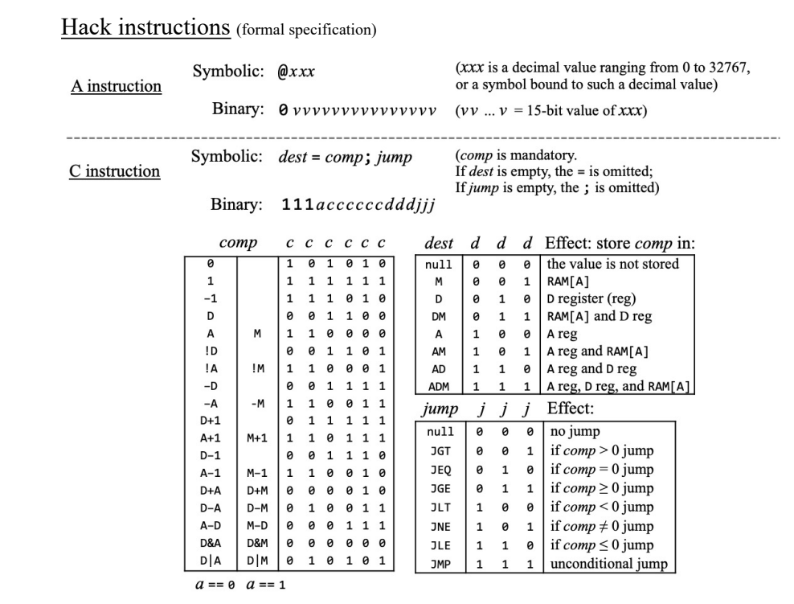
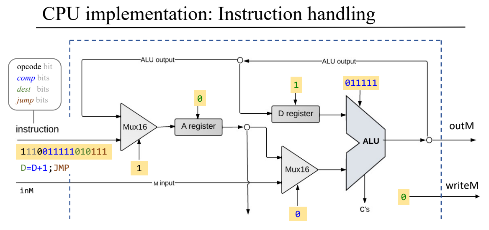
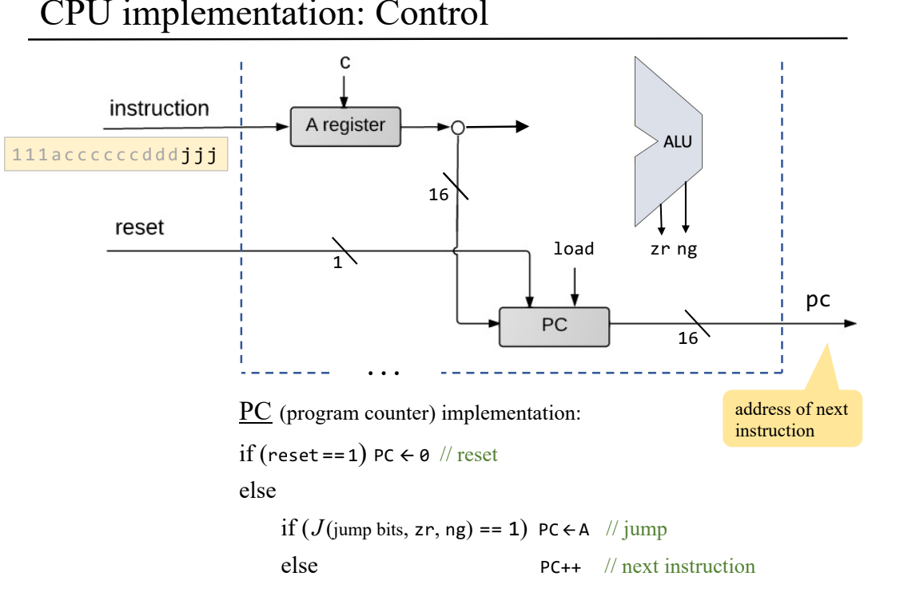

## CPU

### A C Instrction



### Instrction Handling



### PC

```code
CHIP CPU {

    IN  inM[16],         // M value input  (M = contents of RAM[A])
        instruction[16], // Instruction for execution
        reset;           // Signals whether to re-start the current
                         // program (reset==1) or continue executing
                         // the current program (reset==0).

    OUT outM[16],        // M value output
        writeM,          // Write to M? 
        addressM[15],    // Address in data memory (of M)
        pc[15];          // address of next instruction

    PARTS:
    // Put your code here:
    Not(in=instruction[15], out=Ainstruction);//if(instruction[15] == 0 ) is A instruction
    Mux16(a=ALUout, b=instruction, sel=Ainstruction, out=Aregin);
    
    Or(a=Ainstruction, b=instruction[5], out=loadA);   
    ARegister(in=Aregin, load=loadA, out=Aout);
    
    Mux16(a=Aout, b=inM, sel=instruction[12], out=AMout);   

    And(a=instruction[15], b=instruction[4], out=loadD);
    DRegister(in=ALUout, load=loadD, out=Dout);    
    
    ALU(x=Dout, y=AMout, zx=instruction[11], nx=instruction[10], 
        zy=instruction[9], ny=instruction[8], f=instruction[7],
        no=instruction[6], out=ALUout, zr=ZRout, ng=NGout); // calculate
        
    Or16(a=false, b=Aout, out[0..14]=addressM);
    Or16(a=false, b=ALUout, out=outM);
    And(a=instruction[15], b=instruction[3], out=writeM);//只有是C instrcution時 才寫入 Memory
   
    And(a=ZRout, b=instruction[1], out=jeq);    
    And(a=NGout, b=instruction[2], out=jlt);    
    Or(a=ZRout, b=NGout, out=zeroOrNeg);
    Not(in=zeroOrNeg, out=positive);            
    And(a=positive, b=instruction[0], out=jgt);
    Or(a=jeq, b=jlt, out=jle);
    Or(a=jle, b=jgt, out=jumpToA);              
    And(a=instruction[15], b=jumpToA, out=PCload); //只有是C instrcution時才跳
    PC(in=Aout, inc=true, load=PCload, reset=reset, out[0..14]=pc);
}
```
